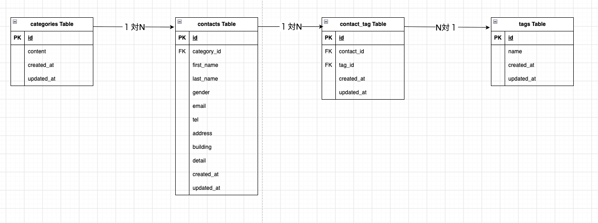

# COACHTECH お問い合わせフォーム


## 概要

プロジェクトの目的と、実装した機能の概要説明

COACHTECHの課題として作成したお問い合わせフォームです。

ユーザーがお問い合わせ内容を入力し、確認画面で内容を確認した後、送信できる機能を実装しています。


## ER図




## 環境構築手順


### 1. Laravelプロジェクトの作成 (Laravel 10.x)

注意: curl -s "https://laravel.build/..." は最新版のLaravelをインストールするため、今回は使用しません。

以下のDockerコマンドを実行して、Laravel 10.xを明示的に指定してプロジェクトを作成します。

プロジェクトディレクトリに移動
```bash
cd contact-form-app
```

Laravel 10.x を指定してプロジェクトを作成
```bash
docker run --rm \
    -u "$(id -u):$(id -g)" \
    -v "$(pwd):/var/www/html" \
    -w /var/www/html \
    -e COMPOSER_CACHE_DIR=/tmp/composer_cache \
    laravelsail/php82-composer:latest \
    composer create-project laravel/laravel:^10.0 contact-form-app
```


### 2. Laravel Sailのインストール

プロジェクト作成後、contact-form-app ディレクトリに移動し、Laravel Sailをインストールします。

プロジェクトディレクトリに移動
```bash
cd contact-form-app
```

Laravel Sailをインストール
```bash
docker run --rm \
    -u "$(id -u):$(id -g)" \
    -v "$(pwd):/var/www/html" \
    -w /var/www/html \
    -e COMPOSER_CACHE_DIR=/tmp/composer_cache \
    laravelsail/php82-composer:latest \
    composer require laravel/sail --dev
```

Sailの設定ファイルをパブリッシュ（MySQLを選択）
```bash
docker run --rm \
    -u "$(id -u):$(id -g)" \
    -v "$(pwd):/var/www/html" \
    -w /var/www/html \
    -e COMPOSER_CACHE_DIR=/tmp/composer_cache \
    laravelsail/php82-composer:latest \
    php artisan sail:install --with=mysql
```

Sailの起動
```bash
./vendor/bin/sail up -d
```

※M1/M2/M3 Mac（Apple Silicon）をお使いの方

Apple Silicon搭載のMacでは、`sail up -d`実行時に以下のエラーが発生することがあります：

```
no matching manifest for linux/arm64/v8
```

解決方法: `compose.yaml`を開き、mysqlサービスに`platform: 'linux/amd64'`を追加してください。
```yaml
mysql:
    image: 'mysql/mysql-server:8.0'
    platform: 'linux/amd64'  # ← この行を追加
    ports:
```


### 3. .env ファイルの設定

.env ファイルを開き、データベース接続情報が以下と一致していることを確認します。
```env
DB_CONNECTION=mysql
DB_HOST=mysql
DB_PORT=3306
DB_DATABASE=laravel
DB_USERNAME=sail
DB_PASSWORD=password
```
重要: DB_HOST は localhost や 127.0.0.1 ではなく、Dockerコンテナ名である mysql を指定します。


### 4. フロントエンドのセットアップ (Vite & Tailwind CSS)

本プロジェクトでは、フロントエンドのスタイリングにTailwind CSSを使用します。

1. NPM依存パッケージのインストール
> 重要: sail npm install を実行する前に、必ずSailコンテナが起動していることを確認してください。
```bash
./vendor/bin/sail npm install
```

2. Tailwind CSSのインストール
```bash
./vendor/bin/sail npm install -D tailwindcss@^3.4.0 postcss autoprefixer
./vendor/bin/sail npm install alpinejs
```

3. 設定ファイルの生成
```bash
./vendor/bin/sail npx tailwindcss init -p
```

4. Tailwind CSSのテンプレートパス設定
tailwind.config.js を開き、以下のように設定します。
```javascript
/** @type {import("tailwindcss").Config} */
export default {
  content: [
    "./resources/**/*.blade.php",
    "./resources/**/*.js",
    "./resources/**/*.vue",
  ],
  theme: {
    extend: {},
  },
  plugins: [],
}
```

5. 提供リポジトリのresourcesディレクトリと入れ替え
以下のリポジトリをクローンし、resourcesディレクトリを丸ごと入れ替えます。
```bash
git clone https://github.com/coachtech-prepared-file/Preparedblade-ConfirmationTest-ContactForm.git
```
入れ替え手順:
① Finderでプロジェクトフォルダを開きます。
open .
② プロジェクト内の resources フォルダを削除します。
③ クローンしたリポジトリ内の resources フォルダをプロジェクト直下にコピーします。

※コマンド操作に慣れている場合は rm -rf と cp -r でも可能ですが、誤削除を防ぐためFinderでの操作を推奨します。

6. Vite開発サーバーの起動
```bash
./vendor/bin/sail npm run dev
```
注意: sail npm run dev は実行したままにしておく必要があります。
コマンドを実行したらターミナルを閉じないようにします。
もし通常のコマンド操作する場合は、
別のターミナルを開いて通常のコマンド操作を続けるようにします。


### 5. phpMyAdminの追加

compose.yaml を開き、mysql サービスの後に以下の設定を追加してください。

compose.yaml に追加する内容:
```yaml
    phpmyadmin:
        image: 'phpmyadmin:latest'
        ports:
            - '${FORWARD_PHPMYADMIN_PORT:-8080}:80'
        environment:
            PMA_HOST: mysql
            PMA_USER: '${DB_USERNAME}'
            PMA_PASSWORD: '${DB_PASSWORD}'
        networks:
            - sail
        depends_on:
            - mysql
```


### 6. Sailの起動とエイリアス設定

./vendor/bin/ を省略して、sail コマンドだけで実行できるようエイリアスを設定します。

Sailをバックグラウンドで起動
```bash
./vendor/bin/sail up -d
```

エイリアスを設定して 'sail' だけでコマンドを実行できるようにする
```bash
echo "alias sail='[ -f sail ] && bash sail || bash vendor/bin/sail'" >> ~/.zshrc
```

または bash の場合
```bash
echo "alias sail='[ -f sail ] && bash sail || bash vendor/bin/sail'" >> ~/.bashrc
```

シェルを再起動するか、新しいターミナルを開いてエイリアスを有効にする
```bash
exec $SHELL
```


### 7. アプリケーションキーの生成

ルートで以下のコマンドを実行する
```bash
sail artisan key:generate
```

※.envファイルの「APP_KEY=」に暗号化用のキーを生成して設定されます。


### 8. データベースのマイグレーションと初期データ投入

以下のコマンドでテーブルを作成し、初期データを投入します。
```bash
sail artisan migrate --seed
```

※既存のデータベースをリセットしたい場合は以下を実行してください。
```bash
sail artisan migrate:fresh --seed
```

⚠️  日本語化／翻訳について:
— 日本語化は FormRequest の `messages()` と `lang/ja`（認証系）で行います。
`laravel-lang/*` 系の外部翻訳パッケージ（`composer require laravel-lang/...`）は導入しないでください。
同系パッケージは 2026年5月のサプライチェーン攻撃でマルウェア配布に悪用された経緯があり、本課題では不要です。


## 使用技術

Laravel 10.50.3

PHP 8.5.10

MySQL 8.4.11

Docker 29.7.2


## APIエンドポイント一覧

| メソッド | URI | 処理 |
|---|---|---|
| GET | `/` | お問い合わせ入力画面を表示 |
| POST | `/contacts/confirm` | 入力内容を確認画面へ送信 |
| POST | `/contacts` | お問い合わせをデータベースに保存 |
| GET | `/thanks` | 送信完了画面を表示 |


## 開発環境URL

http://localhost


## 作成者

高松太郎


